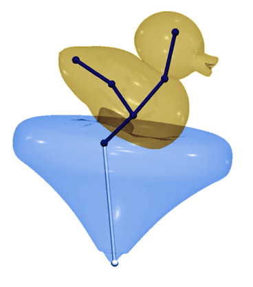

## About me
I am a PhD student specializing in Geometry Processing under the supervision of Prof. Dr. Yusuf Sahillioğlu in Middle East Technical University. My interests also include fine and contemporary arts, particularly new media art. I am passionate about interdisciplinary work at the intersection of engineering, arts, and social sciences.

## [Short CV](https://bartuakyurek.github.io/short-cv/)

## Publications

  
  

    
<strong><a href="https://bartuakyurek.github.io/publications/SDS/" target="_blank" style="text-decoration: none; color: inherit;">Real-Time Secondary Animation with Spring Decomposed Skinning</a></strong>

    
A framework to integrate secondary motion into skinning pipelines using simulated spring bones. Enables real-time dynamics without volumetric mesh input.

  

